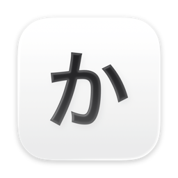

<p align="center">
  
</p>

# CmdKana

[English](README.md) | 日本語

左右の ⌘ キーで英数／かなを切り替える、macOS のメニューバー常駐アプリです。
[⌘英かな (cmd-eikana)](https://github.com/iMasanari/cmd-eikana) がメンテナンスされなくなったため、代わりとして必要最低限の機能だけを実装しました。

## 機能

- 左 ⌘ を単独で押して離す → 英数（英語入力）
- 右 ⌘ を単独で押して離す → かな（日本語入力）
- メニューバーに常駐し、Dock には表示されない
- ログイン時の自動起動（メニューから切り替え）

⌘ を押している間に他のキーやマウスを操作した場合は切り替えないので、⌘C などのショートカットには影響しません。

## 動作環境

- macOS 15 以降
- Xcode 16 以降（ビルドする場合）

## Releases からインストール

1. [Releases](https://github.com/masahosono/cmd-kana/releases) から `CmdKana-vX.Y.Z.dmg` をダウンロードする
2. DMG を開き、`CmdKana.app` を `Applications` にドラッグする
3. `CmdKana.app` を起動する。公証を受けていないため、初回は macOS にブロックされます。システム設定 > プライバシーとセキュリティ で CmdKana の「このまま開く」をクリックし、もう一度起動してください

アプリは ad-hoc 署名のため、リリースごとに署名が変わります。アップデートした後は、アクセシビリティの一覧から CmdKana を削除し、改めて許可してください。

## ソースからビルド

1. `CmdKana.xcodeproj` を Xcode で開く
2. ターゲット CmdKana の Signing & Capabilities で Team を選択する
   - 署名が毎回変わるとアクセシビリティ権限がリセットされるため、Team の設定を推奨します
3. Product > Archive、またはビルドして生成された `CmdKana.app` を `/Applications` にコピーする
4. `CmdKana.app` を起動する

コマンドラインでビルドする場合:

```sh
xcodebuild -project CmdKana.xcodeproj -scheme CmdKana -configuration Release -derivedDataPath build CODE_SIGN_IDENTITY=- build
open build/Build/Products/Release
```

## リリース

バージョンのタグを push すると、GitHub Actions（`.github/workflows/release.yml`）がアプリをビルドして DMG を作り、Releases に公開します。

```sh
git tag v1.0.0
git push origin v1.0.0
```

タグのバージョン（`v` を除いた部分）が、アプリのバージョンになります。

## 初回設定

1. 初回起動時に表示されるダイアログから、システム設定 > プライバシーとセキュリティ > アクセシビリティ を開き、CmdKana を許可する。許可するまでメニューバーには警告アイコンが表示され、そのメニューの「アクセシビリティを許可…」から設定を開けます。許可すると CmdKana が自動で再起動し、アイコンが四角の中の「か」に変わります
2. 自動起動したい場合は、メニューバーの「か」アイコンから「ログイン時に起動」をオンにする

以前 ⌘英かな を使っていた場合は、競合を防ぐため ⌘英かな を終了し、アクセシビリティの一覧からも削除してください。

## 仕組み

| 役割 | 使用 API |
| --- | --- |
| メニューバー常駐 | SwiftUI `MenuBarExtra` + `LSUIElement` |
| ⌘ キーの検出 | `CGEvent.tapCreate`（listen-only のイベントタップ） |
| 入力切り替え | JIS 配列の英数キー（`kVK_JIS_Eisu`）／かなキー（`kVK_JIS_Kana`）のイベントを送出 |
| ログイン時起動 | `SMAppService.mainApp` |

入力ソースを直接指定するのではなく、英数キー／かなキーを押したときと同じイベントを送るので、ことえり・Google 日本語入力などの IME の種類を問わず動作します。

## ファイル構成

```
CmdKana/
├── AppIcon.icon      # アプリアイコン（Icon Composer）
├── CmdKanaApp.swift  # アプリ本体とメニューバー UI
└── KeyMonitor.swift  # ⌘ キーの検出と英数／かなキーの送出
```

## アンインストール

1. メニューから「ログイン時に起動」をオフにして「終了」を選ぶ
2. `/Applications/CmdKana.app` を削除する
3. システム設定 > プライバシーとセキュリティ > アクセシビリティ から CmdKana を削除する
